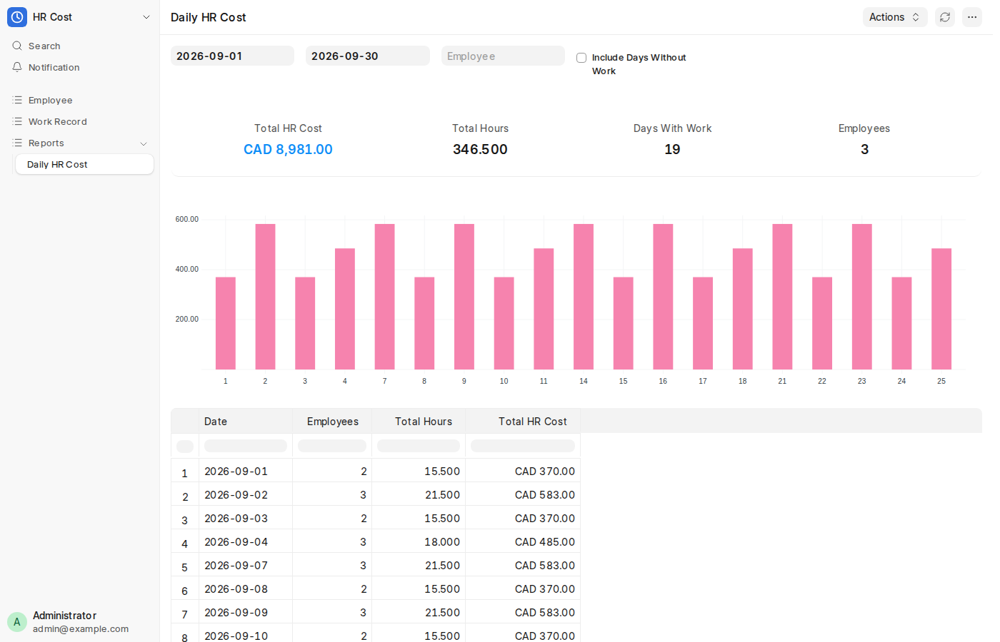
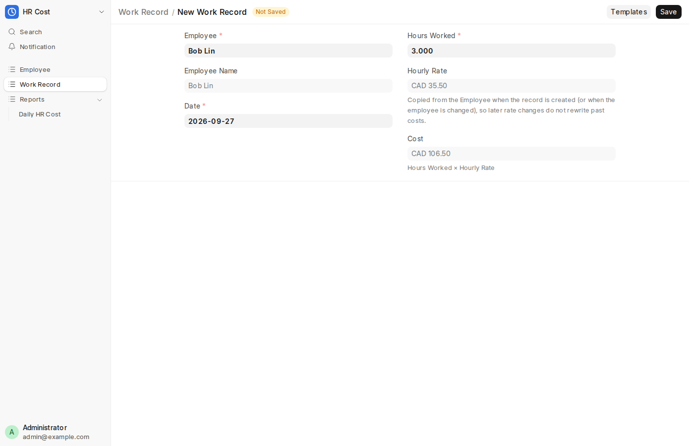

# HR Cost

A small [Frappe](https://github.com/frappe/frappe) app that records employee work hours and reports **total HR cost per day**, with totals for the selected period (the current month by default).

Built and tested on the Frappe **`develop`** branch (`407b551`, 17.0.0-dev). For how the environment was set up (VirtualBox VM → Ubuntu → Frappe `develop`), see **[docs/SETUP.md](docs/SETUP.md)**. [docs/INSTALL_LOG.md](docs/INSTALL_LOG.md) records the actual install: versions, screenshots and the problems hit along the way.



## What's in the app

| Piece | Type | Purpose |
|---|---|---|
| **Employee** | DocType | Employee name and hourly rate |
| **Work Record** | DocType | Hours an employee worked on a date. Cost is calculated on save |
| **Daily HR Cost** | Script Report | One row per day (employees, hours, cost), plus period totals and a chart |

### Employee

| Field | Type | Rules |
|---|---|---|
| ID | Auto: `EMP-00001`, `EMP-00002`, … | Autoname `EMP-.#####` |
| Employee Name | Data | Required. Leading and trailing spaces are trimmed |
| Hourly Rate | Currency | Required. Must be greater than 0 |

### Work Record

| Field | Type | Rules |
|---|---|---|
| ID | Auto: `WR-2026-00001`, … | Autoname `WR-.YYYY.-.#####` (the year the record was *created*, not the work date) |
| Employee | Link → Employee | Required. Shown by name |
| Employee Name | Data (read only) | Fetched from the Employee |
| Date | Date | Required. Defaults to today |
| Hours Worked | Float | Required. `0 < hours ≤ 24`. One employee can log at most 24 h per date in total, across all their records |
| Hourly Rate | Currency (read only) | **Snapshot** of the employee's rate (see design decisions) |
| Cost | Currency (read only) | `Hours Worked × Hourly Rate`, calculated on the server |



### Daily HR Cost report

- **Filters:** From Date and To Date (default: the first and last day of the current month), Employee (optional), and *Include Days Without Work* (adds zero rows so every day in the range appears; limited to 366 days).
- **Columns:** Date · Employees (distinct employees who worked that day) · Total Hours · Total HR Cost.
- **Summary cards:** Total HR Cost · Total Hours · Days With Work · Employees, covering the whole selected period.
- **Chart:** daily HR cost as a bar chart.

## Design decisions (and where they differ from the brief)

The brief lists the fields literally. A few of them were changed on purpose, so the data stays correct:

1. **The brief's free-text *Employee Name* on Work Record is replaced by an `Employee` Link.** A typed name can't tell two people with the same name apart, and it breaks when someone is renamed. The record stores the Employee ID and still shows a read-only *Employee Name* fetched from the Employee, so the field the brief asks for is there.

2. **The hourly rate is snapshotted on each Work Record.** If cost were calculated from the employee's *current* rate, every raise would silently rewrite all past daily costs. So the rate is copied from the Employee when a record is created, when it is moved to a different employee, or if the stored snapshot is empty. Any other save keeps the stored rate, so editing hours later keeps the original rate.
   A plain `fetch_from` would not do this. Frappe re-fetches `fetch_from` fields on **every save** of a non-submitted document (`frappe/model/base_document.py`), so re-saving an old record would overwrite its rate. The snapshot is therefore set in `WorkRecord.set_hourly_rate()`.

3. **Daily rows plus period totals.** The brief says "calculate monthly…" (the sentence looks cut off) but asks for a report of "total HR costs for each day". The report does both: daily rows, a date range that defaults to the current month, and summary cards with the totals for the period.

4. **Summary cards instead of the report's "Add Total Row" option.** Frappe's server-side total row adds up every Int column. That would sum the daily *Employees* head count in exports (3 + 2 + 3 = "8 employees"), which is wrong. The on-screen total row honours `disable_total`, but exports don't.

5. **Permissions.** HR cost is sensitive. The report reads data through `frappe.get_list`, which applies the user's permissions, instead of raw SQL, and the report is restricted to *System Manager*. A test checks that a user without access gets a `PermissionError`.

6. **The server is the source of truth.** The form script only shows a live preview of the rate and cost. Frappe enforces `read_only` only in the Desk form, not in the REST API, so `validate()` enforces it itself. On create, the rate comes from the Employee. On update, the stored snapshot is restored. Cost is always recalculated. Values sent by the browser or the API are therefore ignored (tested for both create and update, and checked with real `POST` and `PUT /api/resource/Work Record` calls).

## Known limitations and possible next steps

- **The snapshot is the rate at the time of entry, not the rate on the work date.** If someone logs last week's hours *after* a raise, the record gets the new rate. The proper fix is an effective-dated rate history on Employee (a child table with `from_date` and `rate`), with the rate looked up by `Work Record.date`.
- **The DocType name `Employee` clashes with ERPNext / Frappe HR**, which already ship an `Employee` DocType. Install this app on a site without those apps, or rename the DocType (for example `HR Cost Employee`).
- **Employee Name on existing Work Records updates only when a record is saved again**, which is how `fetch_from` works. Reports use the Employee link, so they are not affected.
- **Single currency**: amounts use the site's default currency.
- **Work Records are not submittable**, so there is no draft/approved workflow. Adding one would mean making Work Record submittable and filtering the report on `docstatus = 1`.

## Install on an existing bench

```bash
cd ~/frappe-bench
# stop `bench start` first (Ctrl+C); running processes don't pick up a newly added app
bench get-app https://github.com/Suyu0114/hr_cost --branch main
bench --site <your-site> install-app hr_cost
bench start
```

Open **Desk → HR Cost**, or go to `http://<host>:8000/desk/work-record`.

### Demo data (optional)

```bash
bench --site <your-site> execute hr_cost.demo.make_demo_data
```

This creates three employees and weekday Work Records from the 1st of the current month up to today. It does nothing if the demo employees already exist.

## Tests

23 integration tests cover the validation rules, the rate snapshot, the report totals and filters, and permissions.

```bash
# `bench start` must be running in another terminal (the tests need Redis)
bench --site <your-site> set-config allow_tests true
bench --site <your-site> run-tests --app hr_cost
```

> Tests write to the site's database and roll back after each test. Use a dev or test site, not production.

## Project layout

```
hr_cost/
├── hooks.py                      # app metadata + apps-screen tile
├── permissions.py                # who sees the HR Cost tile
├── demo.py                       # optional demo data
├── public/images/hr_cost_logo.svg
└── hr_cost/                      # the "HR Cost" module
    ├── doctype/
    │   ├── employee/             # employee.json / .py / .js / test_employee.py
    │   └── work_record/          # work_record.json / .py / .js / test_work_record.py
    └── report/
        └── daily_hr_cost/        # daily_hr_cost.json / .py / .js / test_daily_hr_cost.py
docs/
├── SETUP.md                      # VirtualBox + Frappe develop setup procedure
├── INSTALL_LOG.md                # record of the actual install (values, screenshots, issues)
├── images/                       # app screenshots
└── screenshots/                  # install screenshots used by INSTALL_LOG.md
```

The DocTypes and the report were created with the site in **developer mode**. In developer mode Frappe exports standard DocTypes and reports as JSON into the app (the same thing happens when you create them in the Desk UI), which is why they can be version-controlled and installed on another site.

## Contributing

This app uses `pre-commit` (ruff, eslint, prettier):

```bash
cd apps/hr_cost
pre-commit install
```

## CI

- **CI** (`.github/workflows/ci.yml`): installs Frappe `develop` with this app on MariaDB 11.8 and runs the tests on every push to `main` and on pull requests.
- **Linters** (`.github/workflows/linter.yml`): runs pre-commit (ruff, eslint, prettier), Semgrep (Frappe rules plus `r/python.lang.correctness`) and pip-audit on pull requests, and can also be started manually.

## License

MIT
