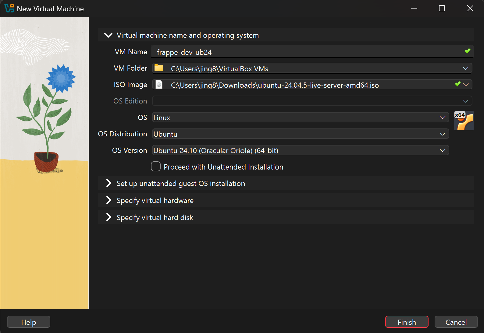
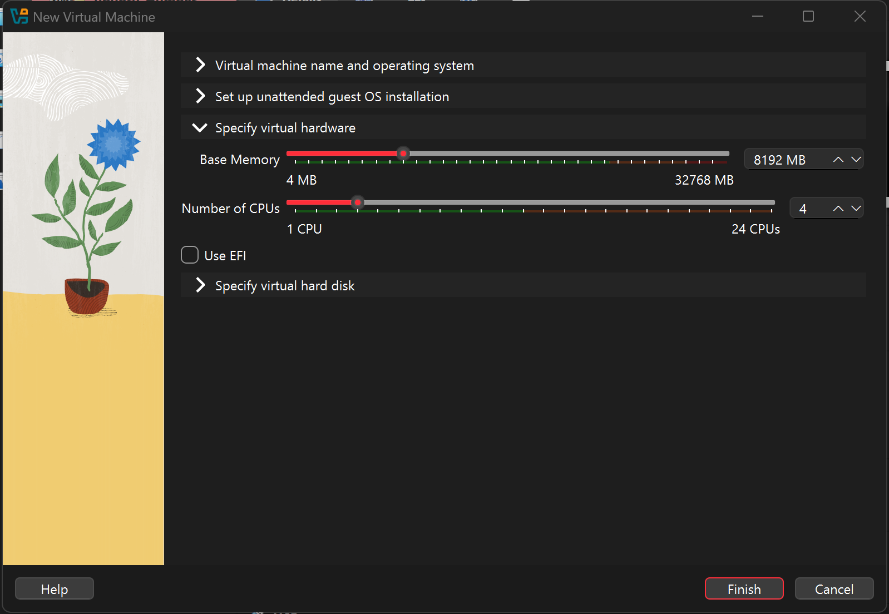
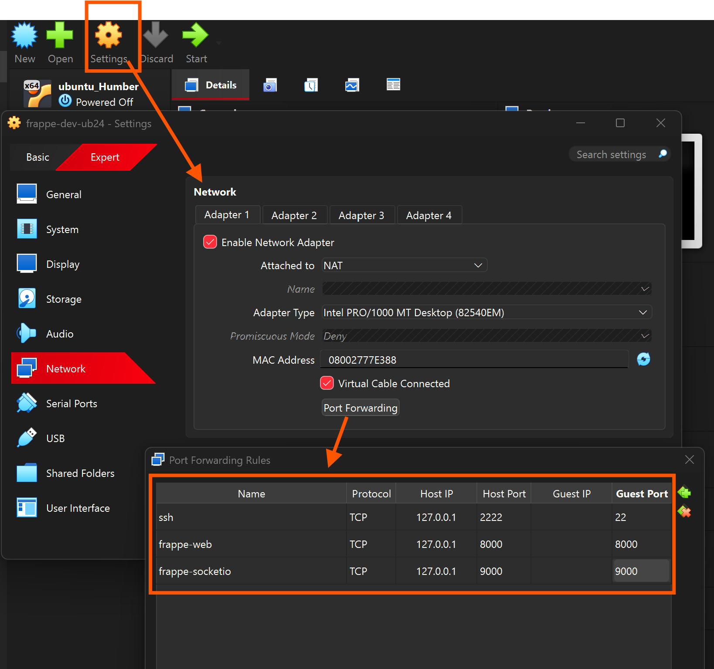
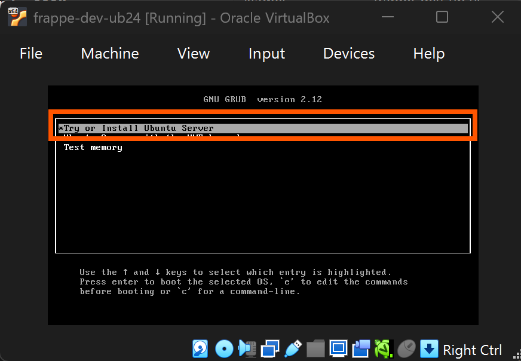
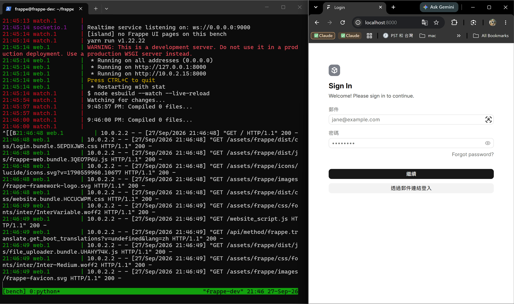
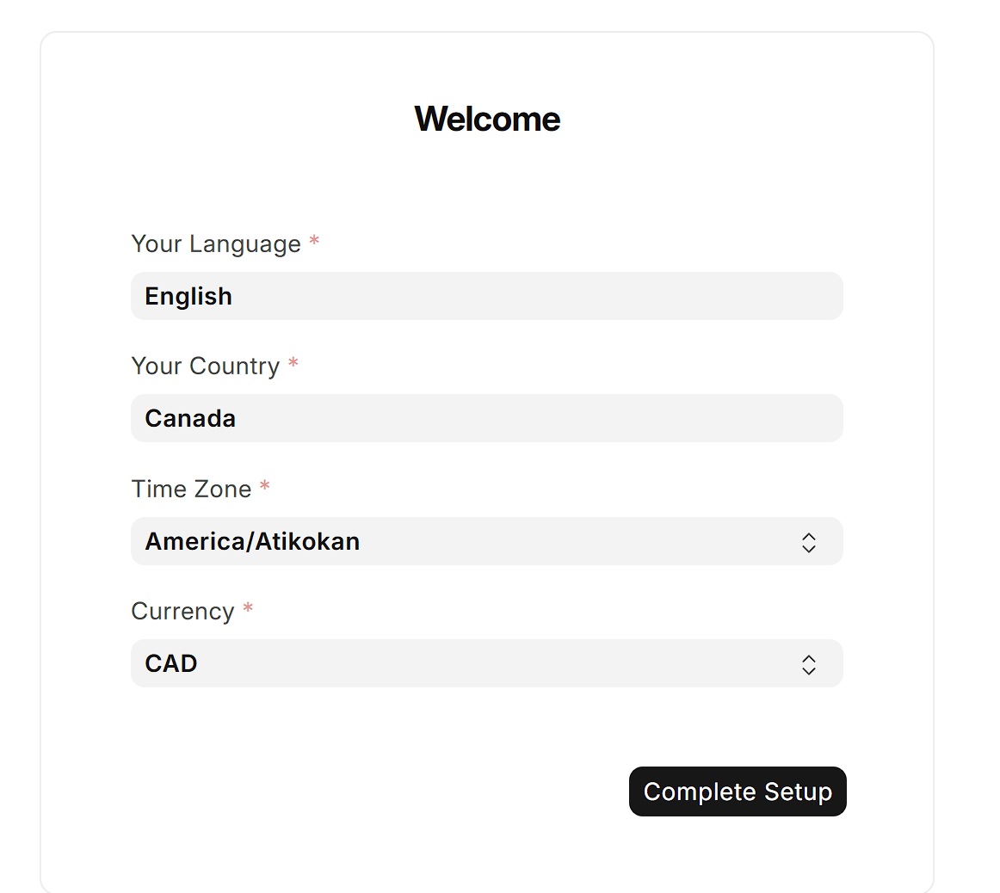

# Installation Log: Frappe VM Setup

> **Purpose**: Step-by-step record of the actual VM setup process, with screenshots and notes.
> This complements [SETUP.md](SETUP.md) which describes the *reference* procedure.

**Date started**: 2026-09-27
**Host machine**: Windows, 32 GB RAM
**VirtualBox version**: 7.2.18 r175117 (Qt6.8.0)
**Frappe version installed**: `develop` @ `407b551` (2026-09-27), reported as `17.x.x-develop`. SETUP.md was written against `775f50f` (2026-09-26)

---

## Pre-flight Checks

| Check | Result | Notes |
|---|---|---|
| VirtualBox version | ✅ 7.2.18 | Already upgraded, meets 7.x requirement |
| Host RAM | ✅ 32 GB | Well above 16 GB recommendation |
| Hardware virtualisation (VT-x/AMD-V) | ✅ Enabled | AMD Ryzen AI 9 HX 370, so **AMD-V** (VT-x is the Intel name). `Win32_Processor.VirtualizationFirmwareEnabled = True`. GUI: Task Manager → Performance → CPU → *Virtualization: Enabled* |
| Hyper-V | ✅ Not installed | `Get-WindowsOptionalFeature` (needs admin, but not manually enabled). The Windows hypervisor still runs because of VBS (next rows) |
| WSL2 | ✅ Not installed | `wsl --status` → "not installed" |
| Core Isolation (Memory Integrity) | ⚠️ **On** | `Win32_DeviceGuard`: `VirtualizationBasedSecurityStatus = 2` (VBS running), `SecurityServicesRunning = {2,3,4}` (2 = Memory Integrity / HVCI, 3 = System Guard Secure Launch, 4 = SMM Firmware Measurement). Registry `…\DeviceGuard\Scenarios\HypervisorEnforcedCodeIntegrity\Enabled = 1`. GUI: Windows Security → Device security → Core isolation details |
| VirtualBox execution engine | ⚠️ Windows Hypervisor Platform (NEM) | `VBox.log`: `HM: HMR3Init: Attempting fall back to NEM: AMD-V is not available`. Because VBS owns AMD-V, VirtualBox runs on top of the Windows hypervisor (green turtle icon), which is slower than native AMD-V |
| Ubuntu Server 24.04 LTS ISO | ✅ Downloaded | `ubuntu-24.04.5-live-server-amd64.iso` |

---

## Step 1: Host Prerequisites

- [x] VirtualBox 7.x installed
- [x] Host RAM sufficient (32 GB)
- [x] Confirm hardware virtualisation enabled (AMD-V)
- [x] Check for Hyper-V / Core Isolation interference → ⚠️ Memory Integrity is on, so VirtualBox runs in the slower Windows Hypervisor Platform mode. Everything still works (the install completed and the 23 tests run in ~2.5 s). Turning it off is optional, see SETUP.md step 1
- [x] Download Ubuntu Server 24.04 LTS ISO (`ubuntu-24.04.5-live-server-amd64.iso`)

---

## Step 2: Create the VM

**Target settings:**

| Setting | Target Value | Actual Value | Status |
|---|---|---|---|
| Name | `frappe-dev` | `frappe-dev-ub24` | ✅ |
| ISO Image | Ubuntu Server **24.04** LTS | `ubuntu-24.04.5-live-server-amd64.iso` | ✅ |
| Type / Version | Linux / Ubuntu (64-bit) | Linux / Ubuntu 24.10 (64-bit) | ✅ |
| Skip Unattended Install | ✅ Uncheck "Proceed with Unattended Installation" | Unchecked | ✅ |
| Base memory | 8192 MB | 8192 MB | ✅ |
| Processors | 4 | 4 | ✅ |
| Hard disk | 40 GB VDI, dynamically allocated | 40 GB | ✅ |





**Port Forwarding rules (NAT):**

| Name | Protocol | Host IP | Host Port | Guest IP | Guest Port | Status |
|---|---|---|---|---|---|---|
| ssh | TCP | 127.0.0.1 | 2222 | *(empty)* | 22 | ✅ |
| frappe-web | TCP | 127.0.0.1 | 8000 | *(empty)* | 8000 | ✅ |
| frappe-socketio | TCP | 127.0.0.1 | 9000 | *(empty)* | 9000 | ✅ |



**Issues encountered:**

1. ❌ First attempt used Ubuntu 26.04 ISO instead of 24.04 LTS
2. ❌ "Proceed with Unattended Installation" was checked — should be unchecked
3. ❌ VM started before Port Forwarding was configured
4. ❌ Unattended install failed with errors in console
5. 🔧 **Resolution**: Power off VM → Delete all files → Recreate with correct ISO and settings

**Boot:**



---

## Step 3: Install Ubuntu Server

- [x] Boot VM from ISO
- [x] Language: English
- [x] Keyboard: English (US)
- [x] Type of install: Ubuntu Server (not minimized)
- [x] Network: DHCP on `enp0s3` → `10.0.2.15/24`
- [x] Storage: Use entire disk (LVM unticked) → 39.07 GB ext4 on `/`
- [x] Profile: Your name `suyu`, server name `frappe-dev`, username `frappe`
- [x] SSH: Install OpenSSH server
- [x] Featured snaps: none
- [x] Reboot completed successfully

**Ubuntu version installed**: 24.04.5 LTS (GNU/Linux 6.8.0-142-generic x86_64)

**SSH access verified from Windows:**

```
(base) PS C:\Users\jing8> ssh -p 2222 frappe@127.0.0.1
Welcome to Ubuntu 24.04.5 LTS (GNU/Linux 6.8.0-142-generic x86_64)
frappe@frappe-dev:~$
```

---

## Step 4: System Packages

```bash
sudo apt update && sudo apt -y upgrade
sudo timedatectl set-timezone America/Toronto
sudo apt install -y git curl build-essential pkg-config \
  mariadb-server mariadb-client libmariadb-dev \
  redis-server
```

- [x] System updated
- [x] Timezone set to America/Toronto
- [x] Packages installed

---

## Step 5: MariaDB Root Password

```bash
sudo mariadb -e "SET PASSWORD FOR 'root'@'localhost' = PASSWORD('<db-root-password>');"
```

- [x] Root password set
- [x] Verified: `mariadb -h 127.0.0.1 -u root -p -e "select version();"` → **10.11.14-MariaDB**

---

## Step 6: Node.js 24 and Yarn (via nvm)

```bash
curl -o- https://raw.githubusercontent.com/nvm-sh/nvm/v0.40.3/install.sh | bash
source ~/.bashrc
nvm install 24
npm install -g yarn
```

- [x] nvm installed (v0.40.3)
- [x] Node.js 24.x installed — actual version: **v24.21.0**
- [x] Yarn installed — actual version: **1.22.22**

---

## Step 7: Python 3.14 (via uv) and bench CLI

```bash
curl -LsSf https://astral.sh/uv/install.sh | sh
source $HOME/.local/bin/env
uv python install 3.14
uv tool install frappe-bench
```

- [x] uv installed — version: **0.12.19**
- [x] Python 3.14 installed — actual version: **3.14.7** (`/home/frappe/.local/share/uv/python/cpython-3.14-linux-x86_64-gnu/bin/python3.14`)
- [x] bench CLI installed — actual version: **5.31.0**

---

## Step 8: Create the bench (develop branch)

```bash
cd ~
bench init --frappe-branch develop --python "$(uv python find 3.14)" frappe-bench
cd ~/frappe-bench
```

- [x] bench init completed
- [x] Expected warning: "Cannot connect to redis_cache" (OK at this stage)

---

## Step 9: Create Site + Developer Mode

```bash
cd ~/frappe-bench
bench new-site hr.localhost \
  --db-root-password '<db-root-password>' \
  --admin-password '<admin-password>' \
  --set-default
bench --site hr.localhost set-config developer_mode 1
bench --site hr.localhost clear-cache
```

- [x] Site created (`hr.localhost`, set as default site)
- [x] Developer mode enabled

---

## Step 10: Bind Address for Windows Access

```bash
echo 'export FRAPPE_BIND_ADDR=0.0.0.0' >> ~/.bashrc
source ~/.bashrc
```

- [x] FRAPPE_BIND_ADDR set to 0.0.0.0 (verified in step 11: `web.1` logs `Running on all addresses (0.0.0.0)`)

---

## Step 11: Start Frappe + Setup Wizard

```bash
cd ~/frappe-bench
bench start
```

- [x] `bench start` running inside `tmux` (session `bench`)
- [x] http://localhost:8000 accessible from Windows browser
- [x] Setup wizard completed (language, country, timezone, currency)

`bench start` output: web on `0.0.0.0:8000` (reachable as `127.0.0.1` and `10.0.2.15`), realtime on `ws://0.0.0.0:9000`. Requests from Windows arrive from `10.0.2.2`, the VirtualBox NAT gateway.



**Setup wizard choices:**

| Field | Value |
|---|---|
| Language | English |
| Country | Canada |
| Timezone | America/Toronto |
| Currency | CAD |

> The screenshot below shows America/Atikokan, which is what was first picked in the wizard. It was then changed to **America/Toronto** in System Settings → Time Zone, to match SETUP.md, the VM's OS time zone and `site_config.json`.



---

## Step 12: Install HR Cost App

The app has no git remote yet, so instead of `bench get-app` the folder was copied from Windows with `scp`. `bench get-app` would also have pip-installed the app and added it to `sites/apps.txt`. With `scp`, both have to be done by hand.

From Windows (PowerShell):

```powershell
scp -r -P 2222 "c:\Users\jing8\Desktop\myProject\vm_linux_hr\hr_cost" frappe@127.0.0.1:/home/frappe/frappe-bench/apps/
```

In the VM, with `bench start` stopped:

```bash
cd ~/frappe-bench
bench pip install -e apps/hr_cost                    # put hr_cost on the bench's Python path
printf "frappe\nhr_cost\n" > sites/apps.txt          # register it with the bench
bench --site hr.localhost install-app hr_cost
bench --site hr.localhost migrate
bench --site hr.localhost execute hr_cost.demo.make_demo_data
bench start
```

- [x] App copied to `~/frappe-bench/apps/hr_cost`
- [x] `bench pip install -e apps/hr_cost` → `+ hr-cost==0.0.1`
- [x] `sites/apps.txt` = `frappe`, `hr_cost`
- [x] `install-app` → `Installing hr_cost... Updating DocTypes for hr_cost`
- [x] `migrate` completed
- [x] `bench --site hr.localhost list-apps` → `frappe 17.x.x-develop (407b551)`, `hr_cost 0.0.1`
- [x] Demo data → `Created 3 employees and 49 work records.`
- [x] Daily HR Cost report (current month): 19 days with work, 346.5 hours, total **CAD 8,981.00**
- [x] HR Cost tile opens the Work Record list in the HR Cost sidebar (after the route fix below)

**Issues encountered:**

1. ❌ `install-app` → `ModuleNotFoundError: No module named 'hr_cost'`
   The copied folder isn't a Python package the bench knows about yet.
   🔧 `bench pip install -e apps/hr_cost`
2. ❌ `install-app` → `App hr_cost not in apps.txt`
   🔧 First tried `echo "hr_cost" >> sites/apps.txt`, but `apps.txt` had no trailing newline, so the file became `frappehr_cost` and the next attempt failed with `No module named 'frappehr_cost'`. Rewriting the whole file with `printf "frappe\nhr_cost\n" > sites/apps.txt` fixed it.
3. ❌ `bench start` → `Could not create server TCP listening socket 127.0.0.1:11000 / 13000: bind: Address already in use`, then `Port 8000 is in use by another program`
   An earlier `bench start` (started 21:48) had been suspended with **Ctrl+Z** rather than stopped with Ctrl+C. A suspended process keeps its ports. `pkill -f redis-server` and `pkill -f "bench start"` freed the ports, but they missed the suspended `honcho start` process and its RQ worker. That worker kept taking jobs from the queue with a Python path from before `hr_cost` was installed.
   🔧 Stopped the leftover `honcho` process group (`kill` by PID). Check for leftovers with `ps -eo pid,stat,etimes,cmd | grep -E "honcho|bench_helper"`, where a `T` in the STAT column means suspended.
4. ❌ Clicking the **HR Cost** tile → *"Not found: Page hr-cost not found"*
   `hooks.py` sent the tile to `/desk/hr-cost`. On this `develop` build, a one-segment desk route resolves to a **Workspace** of that name (`router.js`: *"A one-segment route never carries a shell"*), and the app ships no Workspace. The site had none either (`frappe.get_all("Workspace")` listed only Frappe's own 8). The HR Cost sidebar isn't a document at all: Frappe computes it from the module's DocTypes and reports (`sidebar.get_computed_base("HR Cost")` → Employee, Work Record, Reports → Daily HR Cost). It is reached through them, as `/desk/hr-cost/<doctype>`.
   🔧 Changed the tile's route in `hooks.py` to `/desk/work-record`. The router then writes the shell in front, giving `/desk/hr-cost/work-record`. Copied the file to the VM, then ran `bench --site hr.localhost clear-cache`. `frappe.apps.get_apps()` now returns `route: /desk/work-record`.

---

## Step 13: Run Tests

```bash
cd ~/frappe-bench
bench --site hr.localhost set-config allow_tests true
bench --site hr.localhost run-tests --app hr_cost
```

- [x] `bench start` running in the tmux session (the tests need its Redis)
- [x] **Ran 23 tests in 2.455s — OK**
  - Work Record: 9 · Employee: 6 · Daily HR Cost report: 8
  - One `V17FrappeDeprecationWarning` (`limit_page_length`) is printed during `test_user_without_access_cannot_read_costs`. It comes from Frappe's own `frappe/model/qb_query.py`. The app's code doesn't use `limit_page_length`.

---

## Post-install notes

| Item | Value / note |
|---|---|
| Time zone | ✅ **America/Toronto** in System Settings (changed from the wizard's America/Atikokan), `site_config.json` and the VM OS |
| Scheduler | Enabled (`bench --site hr.localhost scheduler status`) |
| Redis warning | `WARNING Memory overcommit must be enabled!` on every `bench start`. Harmless on a dev VM. To silence it: `sudo sysctl vm.overcommit_memory=1` (add it to `/etc/sysctl.conf` to keep it) |
| SSH key | `~/.ssh/frappe_dev_ed25519` on Windows is authorised in the VM's `~/.ssh/authorized_keys` (`ssh -i ~/.ssh/frappe_dev_ed25519 -p 2222 frappe@127.0.0.1`) |

---

## Appendix: Troubleshooting Encountered

| Issue | Resolution |
|---|---|
| First VM created with wrong ISO (26.04 instead of 24.04 LTS) | Deleted VM, re-downloaded 24.04 LTS ISO |
| Unattended install checked by mistake | Recreated VM with checkbox unchecked |
| VM started before port forwarding configured | Deleted and recreated VM |
| `install-app`: *No module named 'hr_cost'* after copying with `scp` | `bench pip install -e apps/hr_cost` |
| `install-app`: *App hr_cost not in apps.txt* / *No module named 'frappehr_cost'* | `printf "frappe\nhr_cost\n" > sites/apps.txt` (`echo >>` joined it onto the last line) |
| `bench start`: *Address already in use* on 11000 / 13000 / 8000 | An old `bench start` was suspended with Ctrl+Z. Stop the leftover `honcho` process group, and always stop `bench start` with Ctrl+C |
| HR Cost tile: *Page hr-cost not found* | Tile route changed from `/desk/hr-cost` to `/desk/work-record` in `hooks.py` |
